**<u>Image
to OLED</u>** **Method** **1:** **JPG/PNG** **to** **OLED** **using**
**image2cpp**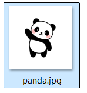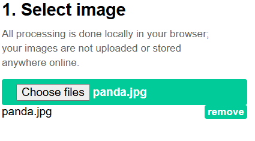

> **1)** **Take** **an** **Image** **like** **panda.jpg**
>
> **2)** **Open** **this** **website**
> ➔[**<u>https://javl.github.io/image2cpp/</u>**](https://javl.github.io/image2cpp/)
> **3)** **Upload** **Image** **here** ➔
>
> **4)** **Change** **Image** **properties** **from** **here** ➔
>
> 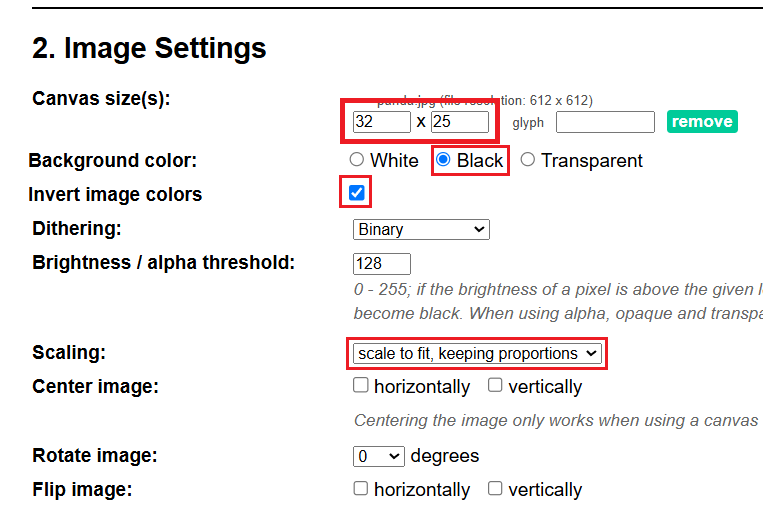 style="width:2.92569in;height:1.97472in" />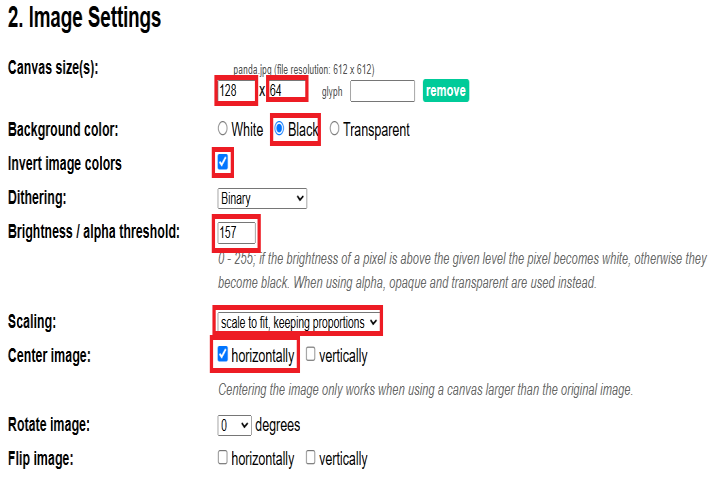 style="width:3.59549in;height:1.91428in" /> style="width:0.86417in;height:0.71583in" />**OR**
>
> 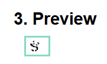 style="width:1.04931in;height:0.6319in" /> style="width:0.90833in;height:0.63542in" /> style="width:0.9525in;height:0.72417in" />**5)** **Here** **you**
> **can** **see** **the** **preview** ➔ **OR**
>
> **6)** **From** **here** **you** **can** **Generate** **&**
> **download** **the** **code** ➔
>
> 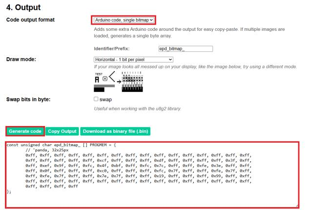 style="width:3.16686in;height:2.15145in" />**Another** **image2cpp**
> **Link:**
> [**<u>https://diyusthad.com/image-to-cpp-v2</u>**](https://diyusthad.com/image-to-cpp-v2)
>
> 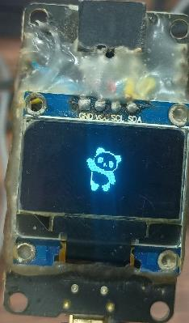 style="width:1.06239in;height:1.81458in" />**7)** **Output** ➔

**GIF** **Image** **to** **OLED:**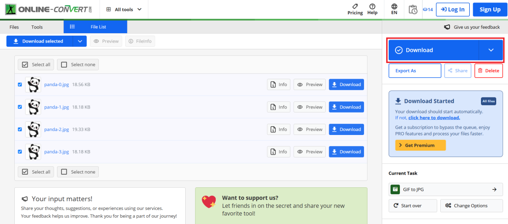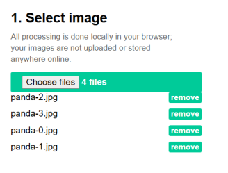

> **1)** **Open** **this** **website**
> ➔[**<u>https://image.online-convert.com/convert/gif-to-jpg</u>**](https://image.online-convert.com/convert/gif-to-jpg)
>
> 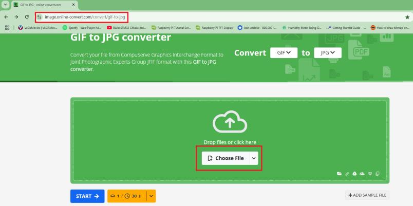 style="width:4.025in;height:2.00667in" />**Tutorial** **Link:**
> [**<u>https://github.com/upiir/ardu</u>**](https://github.com/upiir/arduino_oled_animations)
> [**<u>ino_oled_animations</u>**](https://github.com/upiir/arduino_oled_animations)
>
> **Download** **Animations** **Link:**
> [**<u>https://animator.wokwi.com/</u>**](https://animator.wokwi.com/)
>
> **2)** **Drop** **here** **a** **gif** **image** **&** **convert**
> **into** **jpg** **3)** **Then** **download** **images** **in** **a**
> **zip** **file**
>
> **4)** **Open** **this** **website**
> ➔[**<u>https://javl.github.io/image2cpp/</u>**](https://javl.github.io/image2cpp/)
>
> 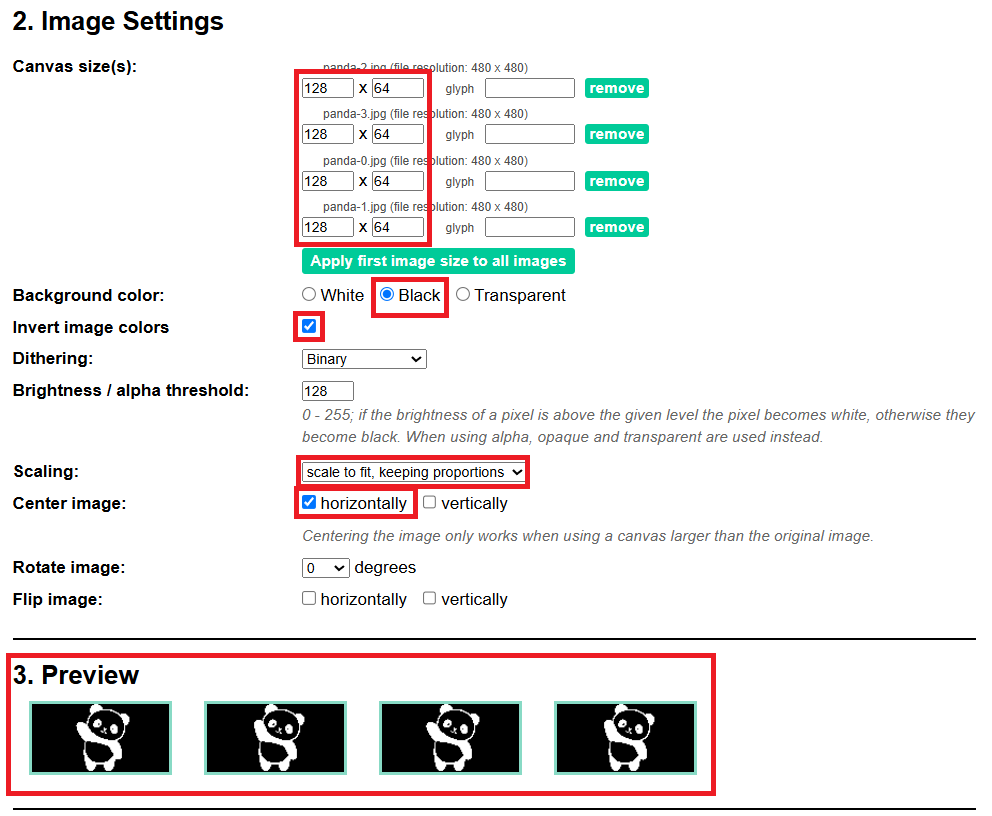 style="width:4.10405in;height:3.37114in" />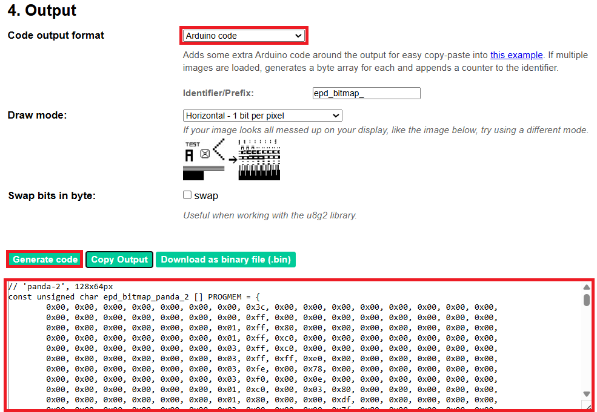 style="width:3.85606in;height:3.393in" />**5)** **Then** **change**
> **the** **pixel** **seting** **to** **128x64** **and** **download**
> **the** **code**

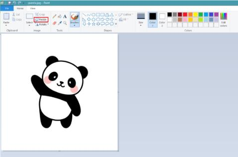**Method** **2:** **JPG/PNG**
**to** **OLED** **using**
[**<u>LCDAssistant</u>**](https://en.radzio.dxp.pl/bitmap_converter/)
**1)** **Take** **an** **Image** **like** **panda.jpg** **and** **open**
**with** **Paint.**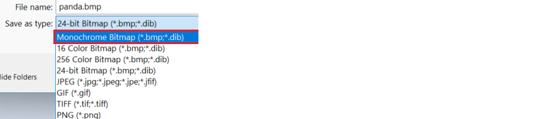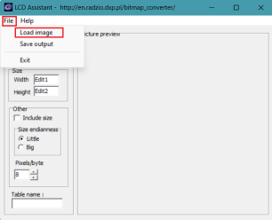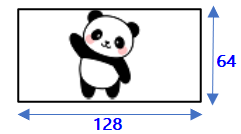

> **2)** **Resize** **this** **image** **to** **128x64** **because**
> **this** **software** **has** **a** **bug** **that** **only**
> **support** **it**
>
> **3)** **Now** **save** **the** **resized** **image** **as** **“bmp”**
> **format**
>
> 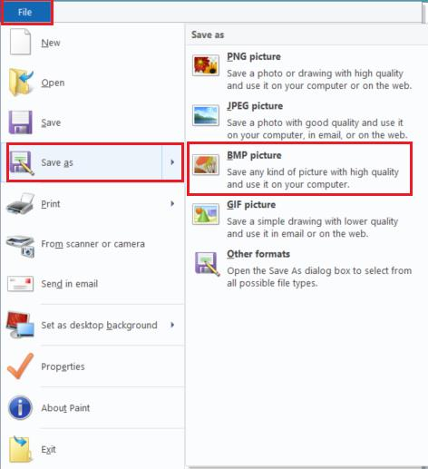 style="width:1.80049in;height:1.9687in" />**Tutorial** **Link:**
> [**<u>https://miliohm.com/how-to-draw-or-print-bitmap-to-oled-display-arduino/</u>**](https://miliohm.com/how-to-draw-or-print-bitmap-to-oled-display-arduino/)
>
> **4)** **Save** **Image** **as** **“monochrome”** **bitmap**
> **format**
>
> **5)** **Now** **open**
> [**<u>“LCDAssistant.exe</u>”**](https://en.radzio.dxp.pl/bitmap_converter/)
> **and** **load** **an** **Image** **file**
>
> 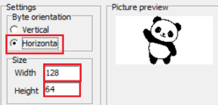 style="width:1.43125in;height:0.69564in" />**6)** **Then** **set**
> **Byte** **orientation** **to** **Horizontal** **&** **size** **must**
> **be** **128x64** **&** **save** **the** **output**

**Method** **3:** **JPG/PNG**
**to** **OLED** **using**
[**<u>lcd-image-converter</u>**](https://lcd-image-converter.riuson.com/en/about/)
**1)** **Take** **an** **Image** **like** **panda.jpg** **and** **open**
**with** **Paint.**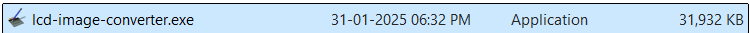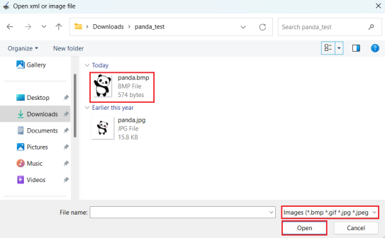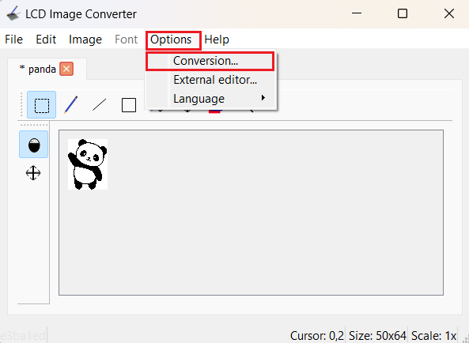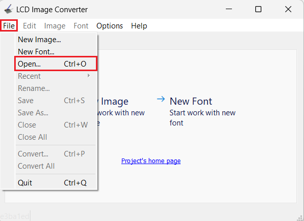

> **2)** **Resize** **this** **image** **to** **as** **per** **your**
> **requirement** **make** **sure** **the** **height** **is** **64**
>
> 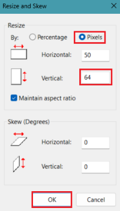 style="width:1.06942in;height:1.88055in" />**Tutorial** **Link:**
> [**<u>https://www.hackster.io/Arnov\_</u>**](https://www.hackster.io/Arnov_Sharma_makes/displaying-your-own-photo-on-oled-display-5a8e8b)
> [**<u>Sharma_makes/displaying-your-own-photo-on-oled-display-5a8e8b</u>**](https://www.hackster.io/Arnov_Sharma_makes/displaying-your-own-photo-on-oled-display-5a8e8b)
>
> **3)** **Now** **open**
> [**<u>“lcd-image-converter.exe</u>”**](https://lcd-image-converter.riuson.com/en/about/)
> **and** **open** **an** **Image** **file**
>
> 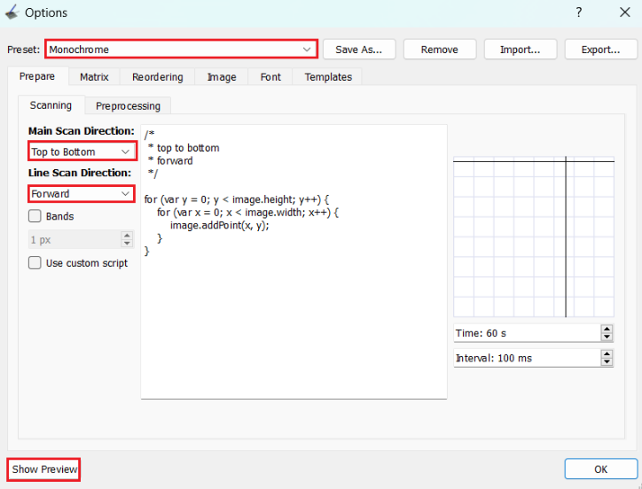 style="width:3.28472in;height:2.50417in" />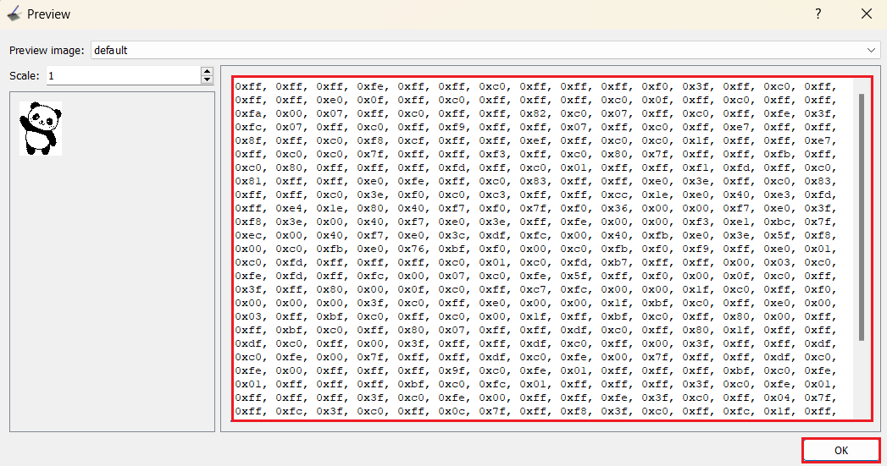 style="width:4.33432in;height:2.27319in" />**4)** **Then** **copy**
> **the** **array** **&** **paste** **in** **your** **code**

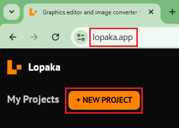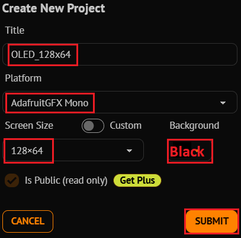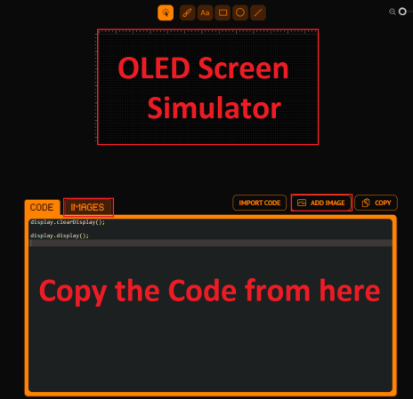**Method** **4:**
**Graphics** **Design** **using**
[**<u>lopaka</u>**](https://lopaka.app/) **1)** **Open** **this**
**website** **&** **create** **a** **new** **project**
➔[**<u>https://lopaka.app/</u>**](https://lopaka.app/)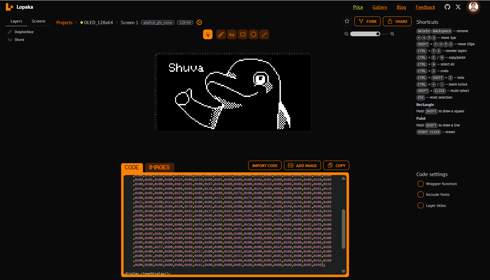

> **2)** **Then** **Design** **what** **ever** **you** **want** **&**
> **then** **copy** **the** **code**

**Other** **Links** ➔

> **1)** **Bulk** **Image** **Resizer:**
> [**<u>https://redketchup.io/bulk-image-resizer</u>**](https://redketchup.io/bulk-image-resizer)
>
> **2)** **Online** **Photo** **Editor** **Software** **(like**
> **photoshop):**
> [**<u>https://www.photopea.com/</u>**](https://www.photopea.com/)
> **or**
> [**<u>https://www.piskelapp.com/</u>**](https://www.piskelapp.com/)
>
> **3)** **Animation** **or** **Icons** **Download:**
> [**<u>https://www.iconarchive.com/</u>**](https://www.iconarchive.com/)
> **or**
> [**<u>https://icons8.com/icons/set/popular--animated</u>**](https://icons8.com/icons/set/popular--animated)
>
> **4)** **Resize** **or** **Crop** **Animated** **GIFs:**
> [**<u>https://www.iloveimg.com/</u>**](https://www.iloveimg.com/)
> **or** [**<u>https://ezgif.com/crop</u>**](https://ezgif.com/crop)
>
> **5)** **PNG** **Image** **Transparent** **Background:**
> [**<u>https://onlinepngtools.com/create-transparent-png</u>**](https://onlinepngtools.com/create-transparent-png)
