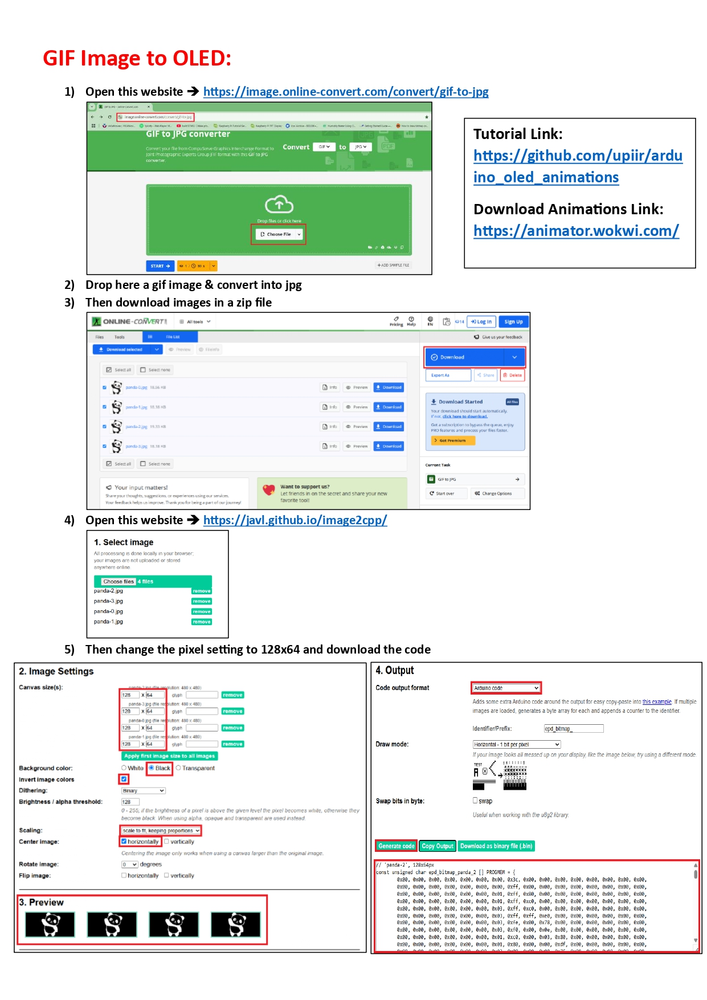

<pre></pre>
<pre></pre>
<pre></pre>
<pre></pre>
<pre></pre>

# Summery

This guide explains how to convert JPG, PNG, or GIF images into code suitable for displaying on OLED screens using three different methods.

---

## Method 1: JPG/PNG to OLED using [image2cpp](https://javl.github.io/image2cpp/)

1. Choose an image (e.g., `panda.jpg`).
2. Open [image2cpp](https://javl.github.io/image2cpp/).
3. Upload the image.
4. Adjust the following settings:
   - Resize to 128x64 or your desired size
   - Set orientation and output format
5. Preview the converted image.
6. Click "Generate" and download the output code.
7. Use the generated array/code in your OLED project.

### Converting GIFs:

1. Go to [GIF to JPG converter](https://image.online-convert.com/convert/gif-to-jpg).
2. Upload your GIF and convert it to JPG.
3. Download the ZIP of images.
4. Open [image2cpp](https://javl.github.io/image2cpp/).
5. Set resolution to 128x64.
6. Generate and download the code for each image.

---

## Method 2: JPG/PNG to OLED using LCDAssistant

1. Open your image in Paint (e.g., `panda.jpg`).
2. Resize it to **128x64 pixels** (mandatory due to software limitation).
3. Save the image as a **monochrome BMP** file.
4. Open `LCDAssistant.exe`.
5. Load the BMP file.
6. Set:
   - **Byte Orientation**: Horizontal
   - **Size**: 128x64
7. Export and save the output code.

---

## Method 3: JPG/PNG to OLED using lcd-image-converter

1. Open the image in Paint.
2. Resize it, ensuring the height is **64 pixels**.
3. Launch `lcd-image-converter.exe`.
4. Open the resized image.
5. Copy the generated array from the tool.
6. Paste it directly into your code.

---

## Method 4: 🖥️ OLED SSD1306 Design using Lopaka.app

This repository provides a step-by-step guide to designing a simple I2C-based OLED SSD1306 display interface using [Lopaka.app](https://lopaka.app). Ideal for projects involving microcontrollers like the STM32F103C8T6 (Blue Pill) or Arduino boards.

---

## 🛠️ Steps to Create the Design

### 1. Open Lopaka
- Go to [https://lopaka.app](https://lopaka.app).
- Click **"New Project"** and name it something like `OLED SSD1306 Test`.

### 2. Add Your Microcontroller
- Click **“Add Component”**.
- Search for and select your microcontroller (e.g., `ESP32` or `STM32F103C8T6` or `Arduino Uno`).
- Place it on the canvas.

### 3. Add the OLED SSD1306
- Click **“Add Component”** again.
- Search for `OLED`, `SSD1306`, or `I2C Display`.
- Select the module and place it on the canvas.
> ⚠️ *If SSD1306 is not directly available, choose a generic I2C OLED module or add a custom part.*

### 4. Connect Components

| OLED Pin | Connects To       |
|----------|-------------------|
| VCC      | 3.3V or 5V        |
| GND      | GND               |
| SCL      | I2C Clock (e.g., PB6 on STM32) |
| SDA      | I2C Data (e.g., PB7 on STM32)  |

- Use the wiring tool to make these connections between the OLED and your MCU.

### 5. Configure I2C
- Click the microcontroller to open configuration options.
- Enable the **I2C interface**.
- Set the correct pins and bus speed (typically 100kHz or 400kHz).

### 6. Export or Simulate
- Use **simulation** features to test logic (if supported).
- **Export code** for STM32 (HAL, LL, or Arduino-style code if available).
- You can also **export the schematic** for use in documentation or PCB design tools.

---

## 🧪 Next Steps
- Use the exported code in **STM32CubeIDE**, **Arduino IDE**, or **PlatformIO**.
- Flash to your microcontroller and test the display.

---

Each of these methods allows you to convert simple images into byte arrays suitable for displaying on 128x64 OLED displays. Choose the method that best suits your needs.
